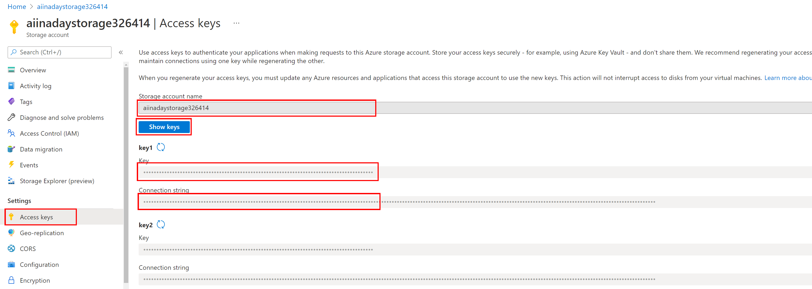

# Setup the Lab 05 AI-in-a-Day workspace

## Task 1 - Deploy Azure Cognitive Services Metrics Advisior instance

## Task 2 - Deploy Azure Machine Learning workspace

## Task 3 - Copy notebooks to the AML workspace

1. In the Jupyter notebook environment, navigate to the folder associated with your lab user.

2. If the folder does not contain any notebooks, download the following items to your local machine:

[Prepare metrics feed data](https://solliancepublicdata.blob.core.windows.net/ai-in-a-day/lab-05/preparemetricsfeeddata.ipynb)

Upload the file by selecting the `Upload` button from the top right corner of the screen, and then selecting the blue `Upload` button to confirm. 

## Task 4 - Prepare Azure Machine Learning workspace

1. Open the [Azure Portal](https://portal.azure.com) and sign-in with your lab credentials. select the storage account named `aiinadaystorageXXXXXX`.

    

2. Select `Containers` and then select `+ Container` to create a new blob storage container.

    

3. Enter `jsonmetrics` as the name, keep all other settings default, and then select `Create` to create the new container.

4.  Select `Access keys` from the left side menu, and then select `Show keys`. Save the storage account name, the `key1 Key` value, and the `key1 - Connection string` value for later use.

    

## Task 5 - Prepare the COVID cases per age group dataset

1. With the Azure Machine Learning studio and the Jupyter notebook environment open, select the `preparemetricsfeeddata.ipynb` notebook.

   Make sure you replace the `<BLOBSTORAGE_ACCOUNT_NAME>` and `<BLOBSTORAGE_ACCOUNT_KEY>` values in the variable initialization cell with the values you have noted down at the end of the previous task.

   The notebook will guide you through a list of steps needed to prepare a time series-based dataset containing JSON files to be fed into the Metrics Advisor workspace. Each JSON file will contain daily data representing the count of COVID positive cases by age group.

2. Execute the notebook cell by cell (using either Ctrl + Enter to stay on the same cell, or Shift + Enter to advance to the next cell) and observe the results of each cell execution.