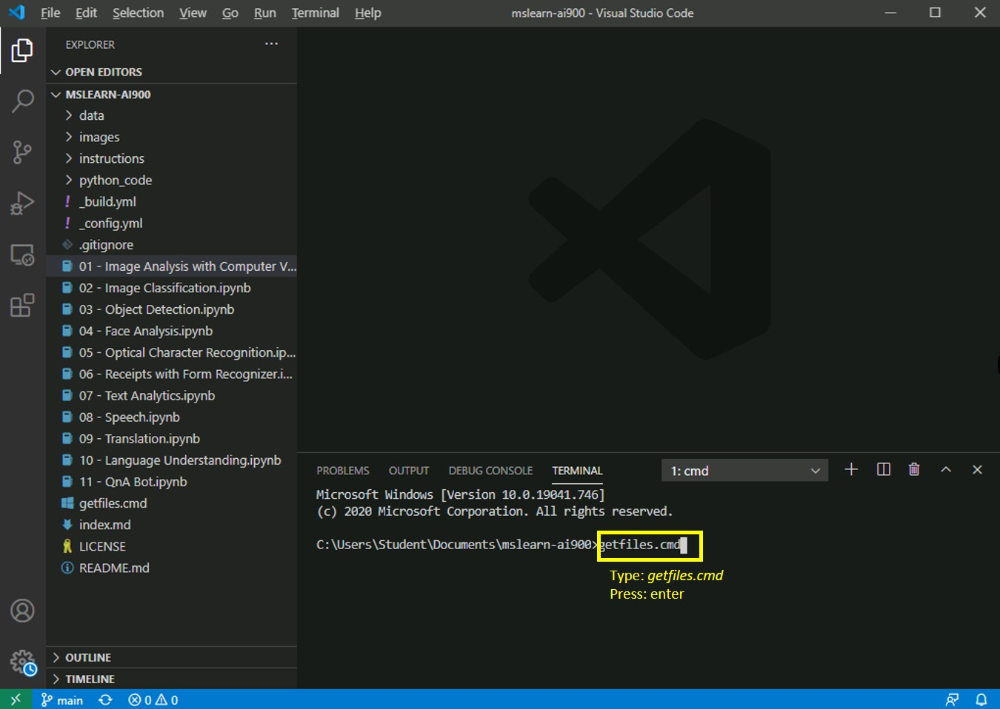

---
lab:
    title: 'Translation'
---

# AI-900 Labs
## Get latest files

1.  Start Visual Studio Code (the program icon is pinned to the bottom taskbar). When it opens, you should see the MSLEARN-AI900 project on the left-hand panel.

2.  We will pull the latest version of the project. In the open terminal type +++getfiles.cmd+++ and press **enter**. This command pulls the latest version of the project to your folder. 
3.  Once the command runs, you can close the terminal panel. Now you can begin the lab. 

In this lab we will create an application that can understand language. 

-  Open the **09 - Translation.ipynb** notebook in Visual Studio Code. 
    **Note:** You may be prompted to complete a 2-minute survey. Go ahead and select **No, thanks**. You may need to do this more than once.
-  Follow the instructions in the notebook to complete the lab.